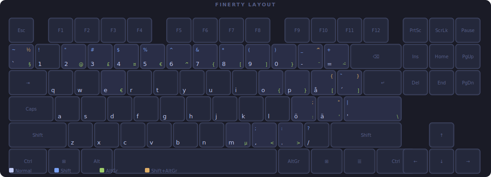

## Finerty, a Finnish keyboard layout for ANSI/us keyboards.

I built my own keyboard, and soon realised that I built one with an ANSI layout rather than the ISO that I was used to :^). I regularly need access to 'ö' and 'ä' so the usual us layout wasn't an option.

I found some cool layouts, such as [swerty by Johan E Gustafsson](https://johanegustafsson.net/projects/swerty/), however I wasn't completely satisfied with them. So naturally, I created my own.

In my opinion the ANSI layout is way better for programming and similar tasks compared to the standard Finnish (nordic ISO) layout. This is hardly surprising as some programming conventions and syntaxes ( using '/' and '$' for example ) were designed mostly with the standard US keyboard in mind. Based on this, the layout simply aims to take the best parts of the ANSI layout while providing easy access to å, ö, and ä.

## Layout

Automatically generated from the **user-wide linux symbols** and kept up to date with Github actions.
